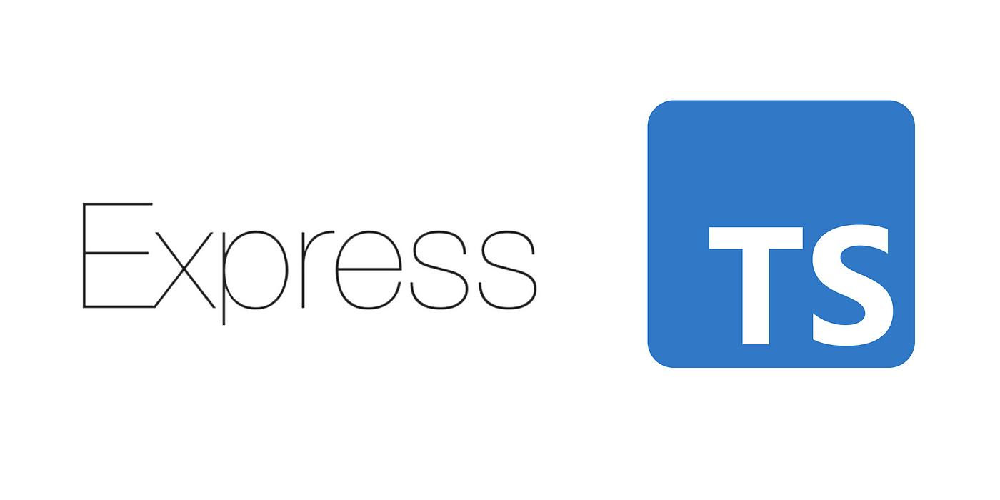

    # Express Ts E-Commerce

## Features

- Examples of `GET`, `POST`, `PUT`, `PATCH`, and `DELETE` requests.
- Modular routers & organized endpoints. See `src/routes`.
- Request Validation using [`Zod`](https://github.com/colinhacks/zod).
- Custom middleware implementation

- Connecting to PostgreDB using [Prisma](https://github.com/prisma/prisma.git)
- Authentication using [JWT](https://jwt.io/)
- Swagger UI [Swagger-Express](https://github.com/scottie1984/swagger-ui-express) and Swagger Jsdoc [Swagger-Jsdoc](https://github.com/Surnet/swagger-jsdoc)
- Automatic Restart using [nodemon](https://github.com/remy/nodemon)
- Hashing Passwords using [bcrypt](https://www.npmjs.com/package/bcrypt).
- Unit Testing examples using [Jest](https://jestjs.io/). See `src/__tests__`.

## Installation

_Note_: You will need DB running locally on your machine.

1. Clone this repository
2. Run `yarn install`
3. Run `yarn start`
4. Server will connect to PosgrestDB & run on Port 3031.

